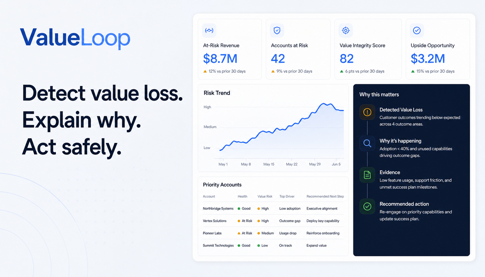

# ValueLoop

ValueLoop is an explainable customer-value intelligence and next-best-action platform for B2B SaaS customer-success teams. It brings product usage, billing, support, feedback, contracts, and customer goals into one Customer 360 workspace so teams can find value loss early, understand the evidence, choose a safe response, and record what happened next.

> **Product thesis:** Do not merely predict churn. Detect value loss, explain the likely cause, recommend the safest next-best action, and learn from the observed outcome.



## Live Demo

- **Web application:** [web-livid-beta-ilnxxzodh3.vercel.app](https://web-livid-beta-ilnxxzodh3.vercel.app)
- **API health check:** [valueloop-api.vercel.app/healthz](https://valueloop-api.vercel.app/healthz)

The demo uses a deterministic, synthetic portfolio of 50 accounts. It demonstrates the product mechanism and governed workflow; it does not claim production predictive accuracy, verified causality, or autonomous execution of real customer actions.

## The Core Feature: A Governed Value-Recovery Loop

ValueLoop's core feature is one connected workflow:

**Detect → Explain → Decide → Approve → Act → Measure**

| Stage | What ValueLoop does | What the user gets |
| --- | --- | --- |
| **Detect** | Unifies account signals and ranks deteriorating accounts by risk, urgency, confidence, and at-risk MRR. | A prioritized portfolio instead of a manual search across disconnected tools. |
| **Explain** | Produces ranked cause hypotheses with supporting evidence, contradictory evidence, timestamps, and rule provenance. | A reviewable explanation rather than an unexplained churn score. Causes remain hypotheses and may be `Unknown`. |
| **Decide** | Filters a fixed action registry through eligibility, consent, safety, state, and frequency rules before ranking useful actions. | A next-best action plus eligible alternatives and explicit reasons for rejected actions. |
| **Approve** | Routes sensitive actions to a human who can approve, modify, or reject them with context and a recorded reason. | Human control over consequential decisions. Models and optional LLMs cannot bypass policy. |
| **Act** | Creates an intervention and moves it through the governed state machine: pending, approved or modified, executed, then delivered. | A simulated or logged response with an owner, status, policy version, and audit history. No real customer is contacted by the prototype. |
| **Measure** | Captures the customer's response and later usage, health, renewal, downgrade, or churn observations. | Evidence of what changed after an intervention, without presenting correlation as causal uplift. |

### Why this is different from a churn dashboard

- It focuses on value realization, not just cancellation prediction.
- It keeps cancellation, downgrade, inactivity, payment-failure, and expansion-readiness risks separate.
- It distinguishes evidence-backed hypotheses from verified causes.
- It blocks inappropriate actions before ranking—for example, payment recovery without payment evidence or an upgrade when experience is poor.
- It preserves customer-friendly options such as pause, downgrade, cancellation, and no action.
- It closes the operational loop with decisions, approvals, interventions, outcomes, and immutable audit events.

### Seeded Northstar Labs scenario

Northstar Labs demonstrates the complete loop. Usage has fallen and severe support tickets remain unresolved, while payment behavior is healthy. ValueLoop surfaces cancellation risk, ranks Technical/Support and Disengagement as likely hypotheses, rejects payment recovery and upgrade actions, and recommends senior support escalation. A CSM can approve the intervention, simulate execution, and later record observed usage and health movement.

## What Each Page Does

Every screen includes a **Page tutorial** button that highlights its main controls and explains how to read the evidence.

| Route | Page | Purpose and key actions |
| --- | --- | --- |
| [`/`](https://web-livid-beta-ilnxxzodh3.vercel.app/) | **Overview** | The portfolio command center. It explains the six-stage workflow, summarizes at-risk MRR, high-risk accounts, action acceptance, and data freshness, and shows the highest-priority accounts. Selecting an account updates its evidence-based risk pass; users can then open Customer 360, the Risk Queue, the Guided Demo, or Playbook Studio. Portfolio MRR and action-mix charts show broader movement. |
| [`/guided-demo`](https://web-livid-beta-ilnxxzodh3.vercel.app/guided-demo) | **Guided Demo** | A non-technical, six-step walkthrough of Detect → Measure. Users can switch between analyzed scenarios, inspect the leading hypothesis and policy result, jump into the account evidence file or Approval Inbox, and finish in Outcomes. This is the fastest way to understand the product. |
| [`/risk-queue`](https://web-livid-beta-ilnxxzodh3.vercel.app/risk-queue) | **Risk Queue** | The operational prioritization workspace. Search and churn-pathway filters narrow the portfolio. Graph view maps each account to its churn pathway and leading issue; its inspector shows the strongest signal, contradiction, and safe response. Table view supports dense comparison of MRR, risk, health, renewal, freshness, and next action. |
| [`/accounts`](https://web-livid-beta-ilnxxzodh3.vercel.app/accounts) | **Accounts** | A searchable Customer 360 directory for finding accounts rather than triaging risk. It summarizes active accounts, managed MRR, profile completeness, and median data age, then lists each account's plan/segment context, health, highest risk, renewal, owner, freshness, and current action. |
| `/accounts/{id}` | **Customer 360** | The main evidence and decision workspace for one account. It combines account metadata, five health dimensions, risk history, separate risk outputs, analysis provenance, ranked cause hypotheses, supporting and contradictory evidence, eligible/rejected actions, intervention controls, and a unified event timeline. From here a user can create an intervention, approve or reject it, execute an approved action, and record an observed outcome. Example: [`/accounts/northstar`](https://web-livid-beta-ilnxxzodh3.vercel.app/accounts/northstar). |
| [`/approvals`](https://web-livid-beta-ilnxxzodh3.vercel.app/approvals) | **Approval Inbox** | The human-control checkpoint. It lists pending governed interventions and provides the selected account's owner, MRR, renewal, freshness, risk context, policy checks, and template explanation. A reviewer can approve, reject, or replace the recommendation with an eligible action; modifications require a reason and update the audit trail. |
| [`/outcomes`](https://web-livid-beta-ilnxxzodh3.vercel.app/outcomes) | **Outcomes** | The measurement workspace. It reports recommendation acceptance, overrides, time to action, observed health movement, weekly decision activity, the latest recovery observation, and intervention history. Usage and health deltas are explicitly labeled as observed changes—not causal proof. |
| [`/audit`](https://web-livid-beta-ilnxxzodh3.vercel.app/audit) | **Audit Log** | The governance record. Users can filter by event/entity type or entity ID, inspect actor, role, action, timestamp, reason, and entity, and expand an event to compare its before and after state. It makes recommendations, overrides, approvals, outcomes, and state transitions traceable. |
| [`/playbooks`](https://web-livid-beta-ilnxxzodh3.vercel.app/playbooks) | **Playbook Studio** | A no-code preview of how teams can configure ValueLoop. Users choose a churn scenario, describe the intended response in plain language, adjust confidence, frequency, approval, and customer-choice guardrails, then test the draft against a synthetic account. Structured policy remains authoritative; the current studio is a reviewable local preview, not a persisted policy editor. |
| [`/data`](https://web-livid-beta-ilnxxzodh3.vercel.app/data) | **Data Ingestion** | A synthetic-data CSV validation screen. It uploads a UTF-8 CSV to the FastAPI ingestion endpoint, requires `id` and `account_id`, then displays job status, accepted rows, and quarantined rows. It does not silently accept malformed input, and it must not be used with real customer data. |

## Health, Risk, and Decision Model

### Five health dimensions

Each account is evaluated across independently visible dimensions:

| Dimension | Example signals |
| --- | --- |
| **Adoption** | Core-feature use, seat activation, and time to first value |
| **Engagement** | Active days, login frequency, breadth, and recency |
| **Experience** | Support severity, resolution time, and customer sentiment |
| **Financial** | Payment success, retries, delinquency, and plan pressure |
| **Value** | Goal completion, realized outcomes, and stakeholder feedback |

### Separate risk outputs

ValueLoop does not compress every customer situation into one generic churn label. Analysis can return cancellation, downgrade, inactivity, payment-failure, and expansion-readiness risks, with confidence, contributors, model/rule version, and analysis timestamp.

### Deterministic control plane

Probabilistic analysis is advisory. Versioned rules govern action eligibility, safety, consent, frequency caps, and approval requirements. Policy filtering happens before utility ranking, and rejected actions retain an explanation. Template-generated explanations remain available when an LLM is absent.

## Architecture

ValueLoop is implemented as a Next.js frontend backed by a FastAPI modular monolith and a Supabase PostgreSQL data store.

```text
Next.js web application
        │ typed /api/v1 client + SWR cache
        ▼
FastAPI modular monolith
        ├── Customer 360 and timeline
        ├── health, risk, and cause hypotheses
        ├── policy and next-best actions
        ├── interventions and outcomes
        ├── audit and dashboard analytics
        └── CSV validation and ingestion
        │
        ▼
Supabase PostgreSQL
        ├── synthetic customer/source events
        ├── versioned analysis records
        └── workflow and immutable audit records
```

| Layer | Technology | Current responsibility |
| --- | --- | --- |
| Web | Next.js 16, React 19, TypeScript, Tailwind CSS, Recharts, Motion, SWR | Responsive product UI, typed API adapters, caching, and explicit fixture fallback |
| API | Python 3.12+, FastAPI, Pydantic | Typed contracts, analysis orchestration, policy decisions, intervention state transitions, ingestion, and safe error envelopes |
| Data | Supabase PostgreSQL | Synthetic source data, computed analysis, interventions, outcomes, and audit history |
| Intelligence | pandas and transparent rules/scoring | Health, distinct risks, confidence, evidence, and cause hypotheses |
| Control plane | Versioned Python plus YAML/JSON policy | Eligibility, safety, frequency, approval, and deterministic fallbacks |
| Deployment | Vercel and Supabase | Hosted frontend, FastAPI application, and managed database |

The API keeps module seams for `health`, `risk`, `causes`, `policy`, `actions`, `interventions`, `outcomes`, `ingestion`, and `audit`. See [`services/api/README.md`](services/api/README.md) for the endpoint and module reference.

## Repository Layout

```text
apps/web/                  Next.js frontend, routes, components, and browser tests
services/api/              FastAPI application, domain modules, and backend tests
packages/                  Shared package space
policies/                  Versioned action and cause policy configuration
data/seeds/                Deterministic synthetic portfolio data
scripts/seed_demo.py       Seed/reset entry point for the 50-account demo
tests/                     Cross-cutting test space
docs/                      Architecture, testing, and decision notes
context.md                 Current implementation phase and unresolved decisions
design.md                  Approved frontend experience and visual specification
ValueLoop_Master_Implementation_Blueprint_FULL.md
                           Authoritative product and architecture blueprint
```

## Run Locally

### Prerequisites

- Node.js 24 and npm
- Python 3.12 or newer (Python 3.13 is used by the current environment)
- A Supabase project with the repository migration applied, if running the live API/data path
- GNU Make and `uv` are optional conveniences

The frontend can run without the API; it displays an explicit offline/demo fallback banner and uses deterministic fixtures. Persistent interventions, outcomes, audit events, live analysis, and ingestion require the API and Supabase configuration.

### 1. Configure the backend

From the repository root:

```powershell
cd services/api
python -m venv .venv
.\.venv\Scripts\Activate.ps1
python -m pip install -e ".[dev]"
Copy-Item .env.example .env
```

On macOS or Linux, activate the environment with `source .venv/bin/activate` and copy the environment file with `cp .env.example .env`.

Set the following values in `services/api/.env`:

| Variable | Purpose |
| --- | --- |
| `SUPABASE_URL` | Supabase project URL |
| `SUPABASE_SERVICE_ROLE_KEY` | Server-only service key; never expose or commit a populated value |
| `SUPABASE_ANON_KEY` | Supabase anonymous key where required |
| `LOG_LEVEL` | API log level, normally `INFO` |
| `API_VERSION` | API version label, normally `v1` |

Seed the deterministic demo and start the API:

```powershell
cd services/api
.\.venv\Scripts\python.exe ..\..\scripts\seed_demo.py
.\.venv\Scripts\python.exe -m uvicorn app.main:app --reload --port 8000
```

The API is available at `http://localhost:8000`; the versioned application routes use the `/api/v1` prefix.

### 2. Configure the frontend

In a second terminal:

```powershell
cd apps/web
npm ci
Copy-Item .env.example .env.local
npm run dev
```

`NEXT_PUBLIC_API_URL` defaults to `http://localhost:8000/api/v1`. Open [http://localhost:3000](http://localhost:3000).

### Optional Make workflow

On an environment with GNU Make and `uv`:

```bash
make install
make seed
make run
```

## Verification

### Fast local checks

```powershell
cd services/api
python -m pytest --cov=app --cov-report=term-missing --cov-fail-under=65
ruff check app tests

cd ../../apps/web
npm run test:contract
npm run test:coverage
npm run typecheck
npm run lint
npm run build
```

### Browser checks

```powershell
cd apps/web
npx playwright install chromium
npm run test:e2e
```

The Playwright suite builds and serves the app with deterministic API envelopes and checks routes, the governed workflow, responsive layouts, keyboard paths, console errors, performance, and WCAG A/AA accessibility violations.

Live Supabase integration tests intentionally reset computed synthetic data. Run them only against a disposable test project:

```powershell
cd services/api
$env:RUN_INTEGRATION_TESTS = "1"
python -m pytest -m integration --cov=app --cov-report=term-missing --cov-fail-under=70
```

See [`docs/testing.md`](docs/testing.md) for the complete test matrix and release gates.

## API at a Glance

| Area | Main endpoints |
| --- | --- |
| Accounts | `GET /api/v1/accounts`, `GET /api/v1/accounts/{id}`, `GET /api/v1/accounts/{id}/timeline` |
| Analysis | `POST /api/v1/accounts/{id}/analyze`; `GET /api/v1/accounts/{id}/health`, `/risks`, `/risk-history`, `/causes`, and `/actions` |
| Interventions | `GET/POST /api/v1/interventions`, `PATCH /api/v1/interventions/{id}` |
| Outcomes | `POST /api/v1/interventions/{id}/outcome`, `GET /api/v1/outcomes` |
| Portfolio | `GET /api/v1/dashboard/kpis`, trend, action-mix, and risk-history routes |
| Governance | `GET /api/v1/audit` |
| Ingestion | `POST /api/v1/ingestion/csv`, `GET /api/v1/ingestion/jobs/{id}` |

Responses use typed envelopes, bounded queries/uploads, safe error messages, and security headers. Consult the generated OpenAPI document or [`services/api/README.md`](services/api/README.md) for details.

## Current Status and Limitations

Implemented today:

- Live synthetic Customer 360, portfolio, risk, evidence, and freshness data
- Five health dimensions and distinct risk outputs
- Ranked cause hypotheses with supporting and contradictory evidence
- Policy-filtered recommendations and rejected-action reasons
- Pending → approved/modified/rejected → executed → delivered intervention workflow
- Observed outcome capture, audit history, and CSV validation/quarantine
- Offline deterministic fixture fallback
- Unit, contract, component, E2E, performance, security, and accessibility coverage

Still incomplete or intentionally out of scope:

- Supabase authentication and production role enforcement
- Autonomous external outreach, billing, plan, or support-system changes
- Production predictive-accuracy or causal-effect claims
- Use of real customer data
- Persisting Playbook Studio drafts as production policy
- Final decisions on model choice, health weights, thresholds, and role boundaries

## Safety and Honesty Guardrails

- Use synthetic demo data only; never commit credentials or real customer information.
- Describe causes as hypotheses and retain conflicting evidence or `Unknown`.
- Never recommend payment recovery without payment evidence.
- Never recommend an upgrade while customer experience is poor.
- Keep downgrade, pause, cancellation, and no-action paths transparent where eligible.
- Require policy checks and human approval before sensitive actions.
- Record rule/model versions, timestamps, actors, reasons, state changes, and outcomes.
- Describe post-intervention changes as observed associations, not proven causal uplift.

## Project Documentation

Read these documents in order when contributing:

1. [`AGENTS.md`](AGENTS.md) — repository and implementation rules.
2. [`context.md`](context.md) — current phase, completed work, and unresolved decisions.
3. [`design.md`](design.md) — approved frontend product and visual specification.
4. [`ValueLoop_Master_Implementation_Blueprint_FULL.md`](ValueLoop_Master_Implementation_Blueprint_FULL.md) — authoritative product, behavior, architecture, API, acceptance, and ethics blueprint.
5. [`docs/testing.md`](docs/testing.md) — verification strategy and release gates.

## License

Internal hackathon project. No external license is currently declared.
